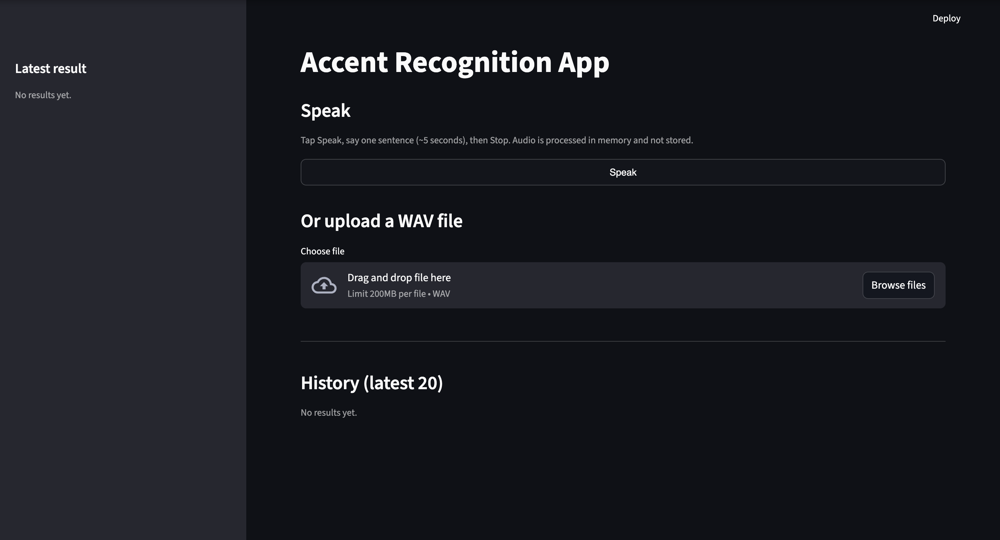
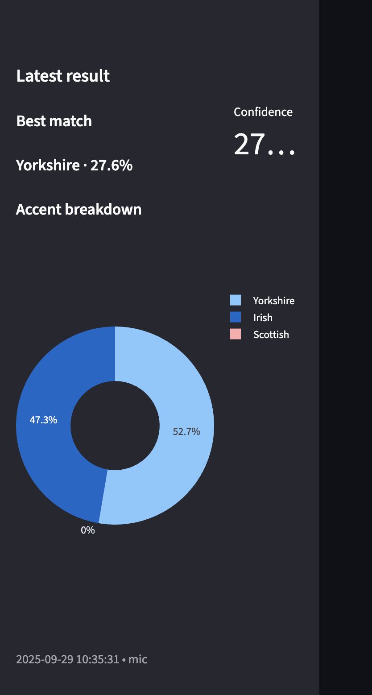
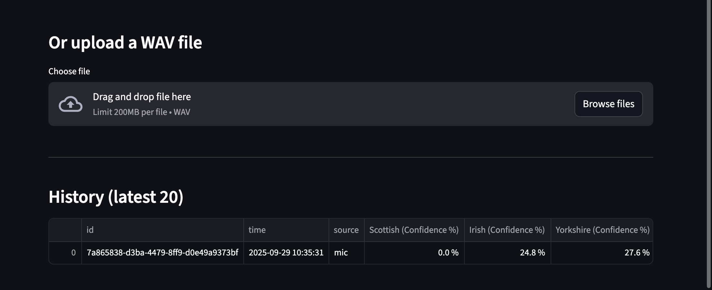
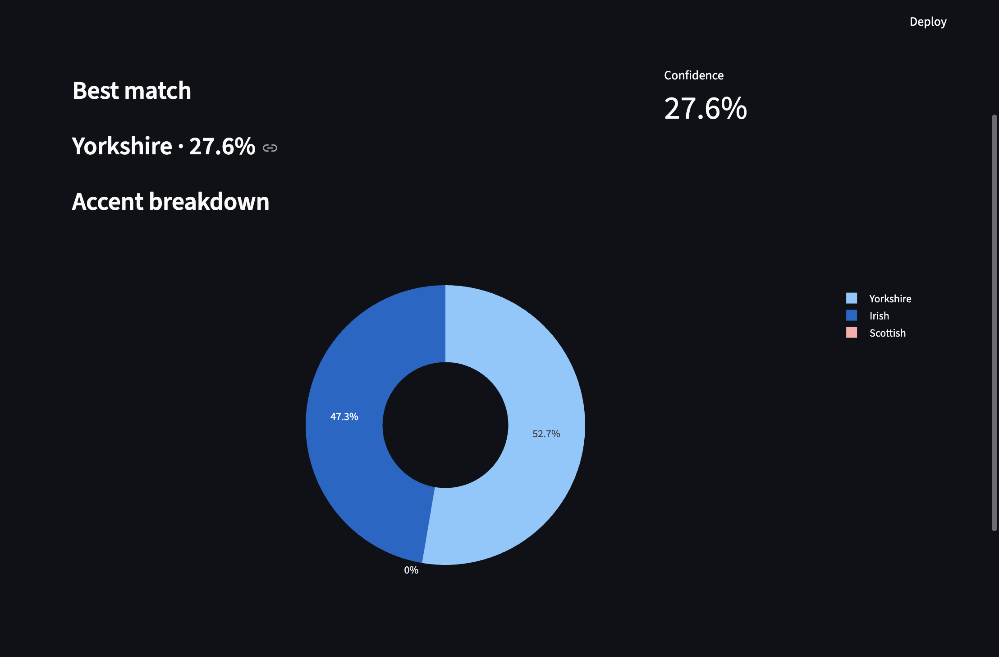

# Overview:
This is a prototype accent recognition application. It records or uploads voice samples and compared them to the stored accents (Irish, Scottish, Yorkshire). The application then shows the most likely accent and a confidence percentage alongside it. The system is built to demonstrate how machine learning features can be useful for voice analysis.

## Features:
- Records voice directly in the app or you can upload a WAV file
- Displays the most likely accent match with a confidence percentage
- Shows a pie chart distribution of similarity across the accents
- Keeps a history of the last 20 recordings, which can be viewed in the app
- The recordings are processed but then discarded and only the results are logged for privacy reasons

## How to run:
1. Clone the repository:
git clone https://github.com/kim210603/accent-recognition
cd accent-recognition

2. Create and activate a virtual environment:
python3 -m venv .venv
source .venv/bin/activate   # Mac/Linux
.venv\Scripts\activate      # Windows

3. Install dependencies (I have frozen the environment for this):
pip install -r ar_requirements.txt

4. Run the application:
streamlit run ar_app.py

## Limitations:
- Only a few accents are included
- The app is based on limited data due to the use of TTS voices (ElevenLabs)

## Screenshots:
Homepage 

Sidebar with latest result 

History Table + Upload files

Pie Chart Breakdown 

## Testing:
### Manual Testing
I have documented manual test cases in ['tests/test_cases'](tests/test_cases.xlsx)
Each test case includes:
- ID and Title: unique identifier and short description 
- Steps: what the tester should do
- Test Data: any input values or files needed
- Expected Results: what the app should show or do
- Actual Results/Status: the outcome of the test when executed

These cover core functions such as:
- Launching the app and confirming it opens correctly (TC01)
- Recording audio through the microphone and recieving recognition results (TC02)
- Uploading WAV audio files and verifying that accent detection works (TC03)
- Rejecting unsupported formats such as MP3 with an error message (TC04)
- Logging results into [Results Log](results_log.csv) (TC05)
- Updating the sidebar with the latest result and chart (TC06)
- Maintaining a history of the last 20 recognitions (TC07)
- Handling empty or silent audio input (TC08)

Overall, 7/8 of the test cases passed. The only one that failed was the silent audio which didn't lower confidence as expected.

### Automated Testing
Due to the project being a prototype, automated tests were limited. But unit tests could be added for the: 
- Prototype loading to confirm the model file is present and readable
- Feature extraction to ensure MFCCs are generated consistently
- Distance calculation to verify similarity scoring works as expected.